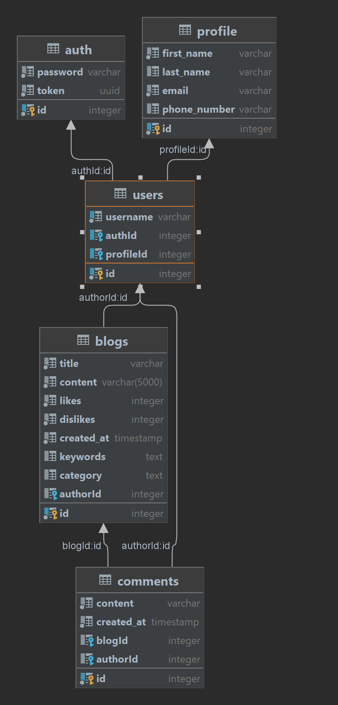

## Node.js Blog API

### Tech Stack

- Express
- Postgres
- TypeORM
- TypeScript

### Installation

- Clone the repo
- Run `npm install` to install dependencies
- Run `npm run dev` to start the server with hot reload (ensure you have nodemon installed globally)
- Run `npm run build` to build the the typescript project
- Run `npm start` to start the server in a node environment
- Additionaly, you can create a docker image of project with `npm run build:image`

### Database Schema

